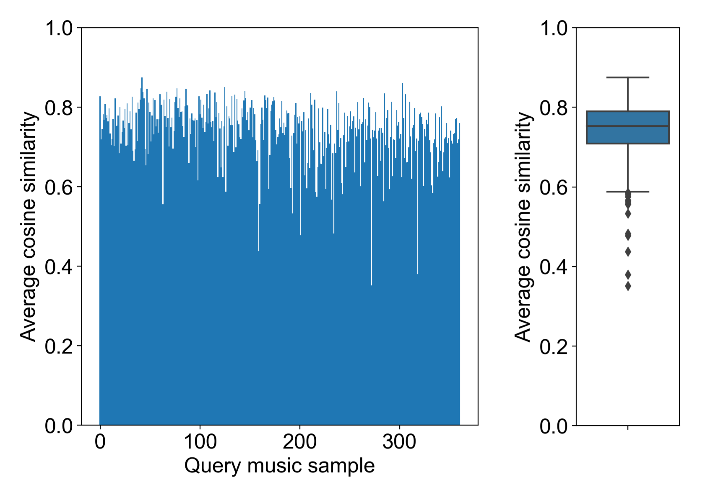
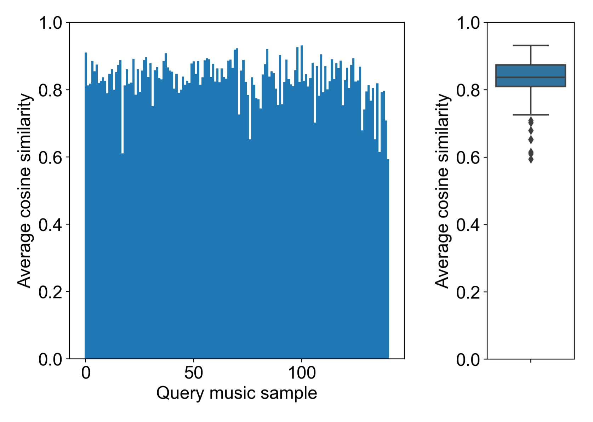
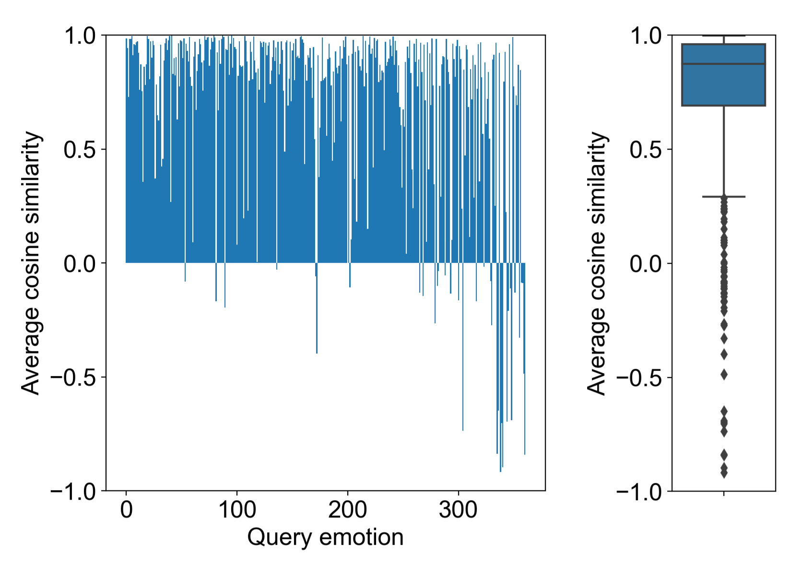
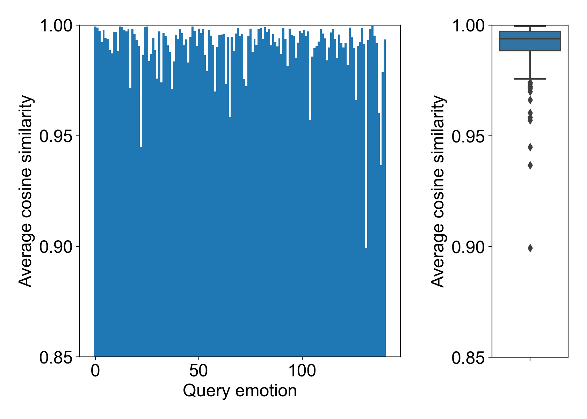

# Additional Results
## Detailed analysis
### bar and box plots for average cosine similarities

#### M2E

DEAM

PMEmo

#### E2M

DEAM

PMEmo

### mean/std of average cosine similarities

|      | DEAM-M2E | DEAM-E2M | PMEmo-M2E | PMEmo-E2M |
| ---- | -------- | -------- | --------- | --------- |
| mean | 0.740    | 0.706    | 0.831     | 0.990     |
| std  | 0.075    | 0.406    | 0.061     | 0.013     |

### percentile values

|     | DEAM-M2E | DEAM-E2M | PMEmo-M2E | PMEmo-E2M |
| --- | -------- | -------- | --------- | --------- |
| min | 0.351    | -0.918   | 0.594     | 0.899     |
| 25% | 0.709    | 0.692    | 0.810     | 0.989     |
| 50% | 0.753    | 0.873    | 0.837     | 0.994     |
| 75% | 0.790    | 0.960    | 0.874     | 0.997     |
| max | 0.875    | 0.999    | 0.932     | 0.9995    |

### trained model using detailed analysis
The models for results of detailed analysis can be found so that [detailed_analysis.zip](https://drive.google.com/file/d/1oA4fuhm5xdeNUcX8d21Pvjl4s8o8zaAO) which includes each model for DEAM and PMEmo is unzip.
If you want to restore this model, you can copy it under src/model and load it by specifying ``detailed_analysis/DEAM`` or ``detailed_analysis/PMEmo`` as the model_dir option in the executable. (ex. ``--model_dir=detailed_analysis/DEAM``)
